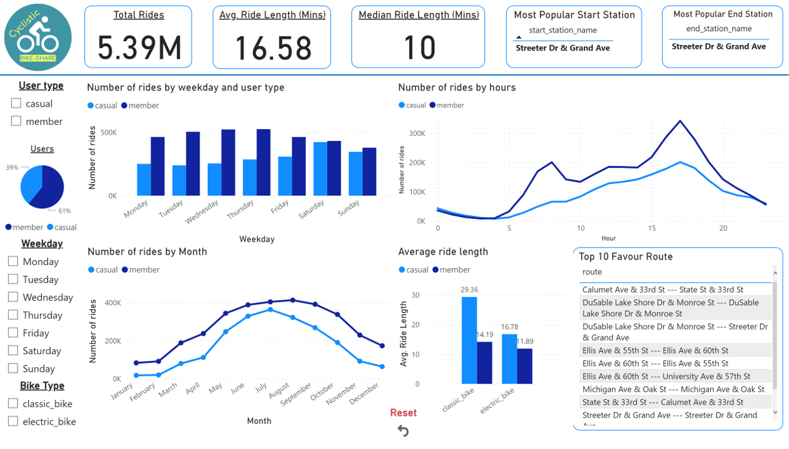

# Google Data Analytics Certificate Capstone Project
## About this project
This is actually my first online course. It was taken for my interest. However, I think I am going to explore further in this career.  

### What is my interest? 
I recognize people often making a statement without any solid evidence to back it up. That also happens to me. And I found only data may solve the problem. Hence, I went to do my research on how to get the correct answer. Then, I found this course. 

### Why Google Data Analytics Certification
Well. I admit there are many courses out there to choose from. I went through some of the reviews and also searched "top data analysis course." And Google data analytics always has a place in any list I found. The same goes for the IBM Data analyst course.   
There are number of YouTubers who review and compare both courses. However, I found that most of them mentioned Google Data Analytics Certification is more friendly to beginners. Hence, I think this is a good place to start. 

### How I felt about the course? 
Google makes it super easy to understand and less tedious. It also provides many extra resources for you to explore. Overall, the course is designed to give you fundamental knowledge to understand the data analysis world. 

### What are the Challenges? 
The most challenging part was the capstone project. I was struggling with how to get it right. Then I found that there is no fixed answers to this. You have followed the method that Google teaches you in the course and do your own analysis to answer the business task. 

#### The Capstone Project
Check out my capstone project [here](https://adamchenjinghao.notion.site/Capstone-Project-of-Google-Data-Analytics-Professional-Certificate-3f32c1b2f73b459f9760597c12a40f4e) 
#### My dashboard

### What is the limitation?
Since it helps you to build your foundation. It would be best if you explored more and more profound on your own. Me, I took SQL for Data Science to understand more about SQL. I also plan to take the "Data Analysis with Python” course from freecodecamp.org.

### Am I recommended this course? 
Yes. It is a good and informative course. 

## Connect with me
[LinkedIn](https://www.linkedin.com/in/adam-cjh/)
or [my Website](https://chenjinghao.github.io/) 

---

